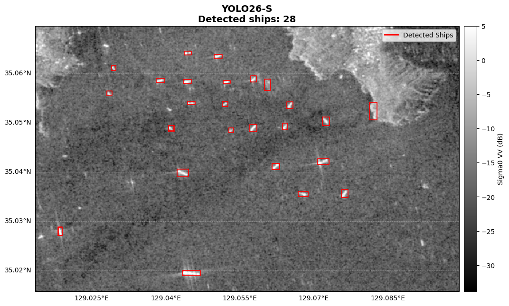
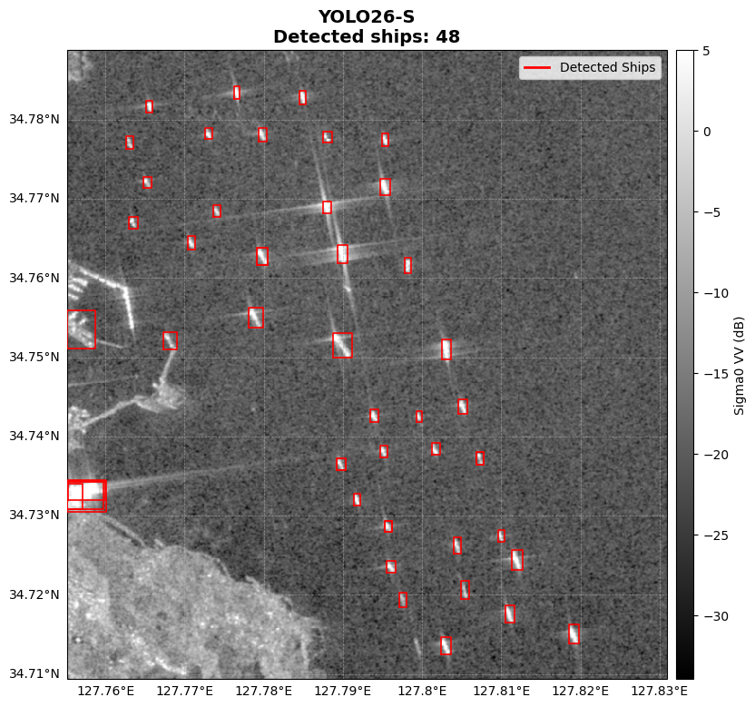
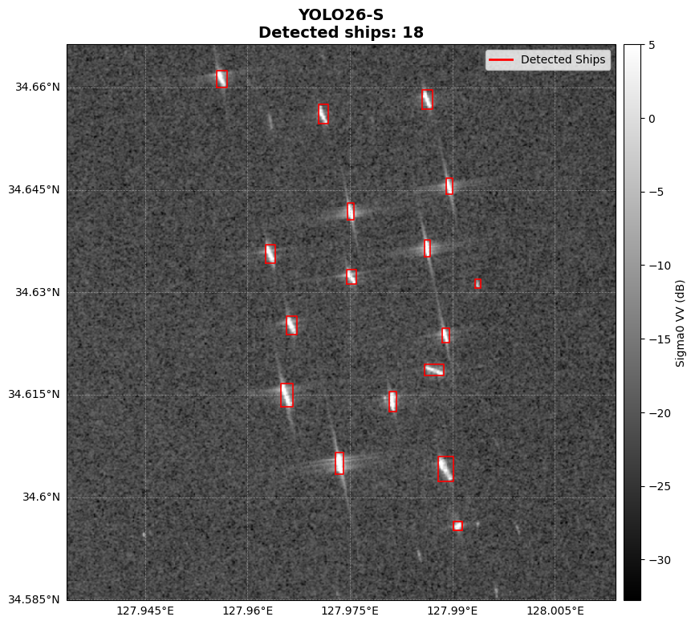
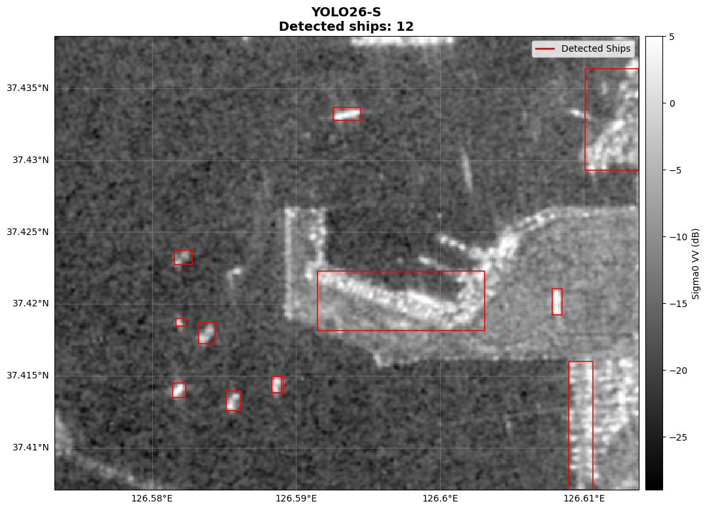
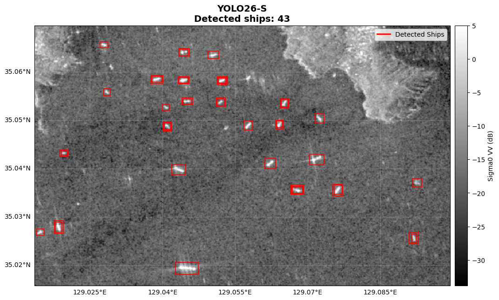
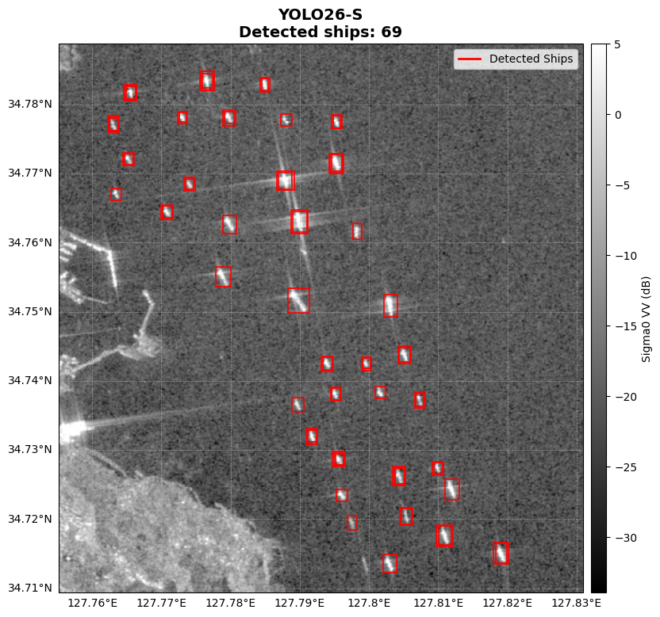
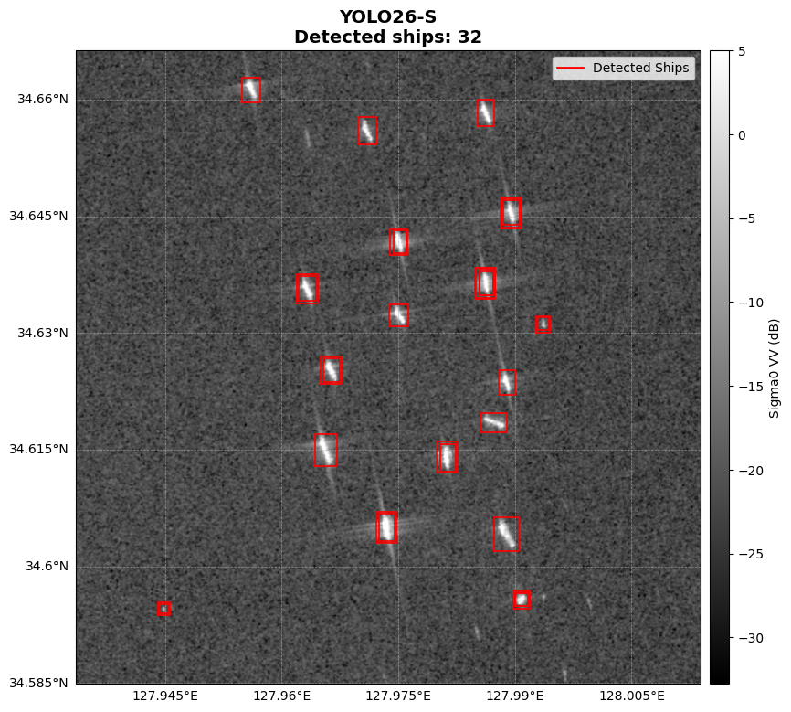
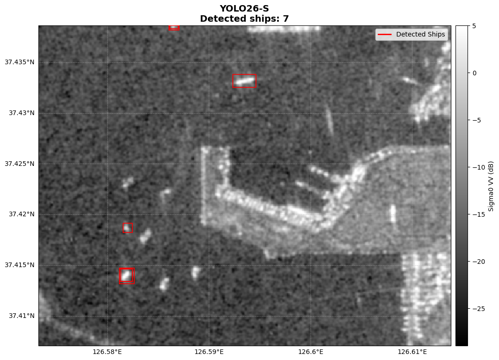
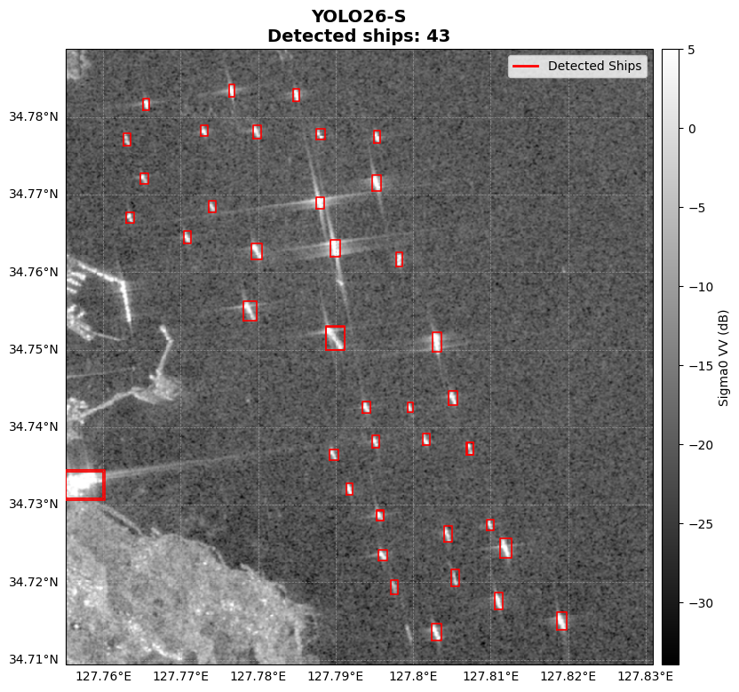
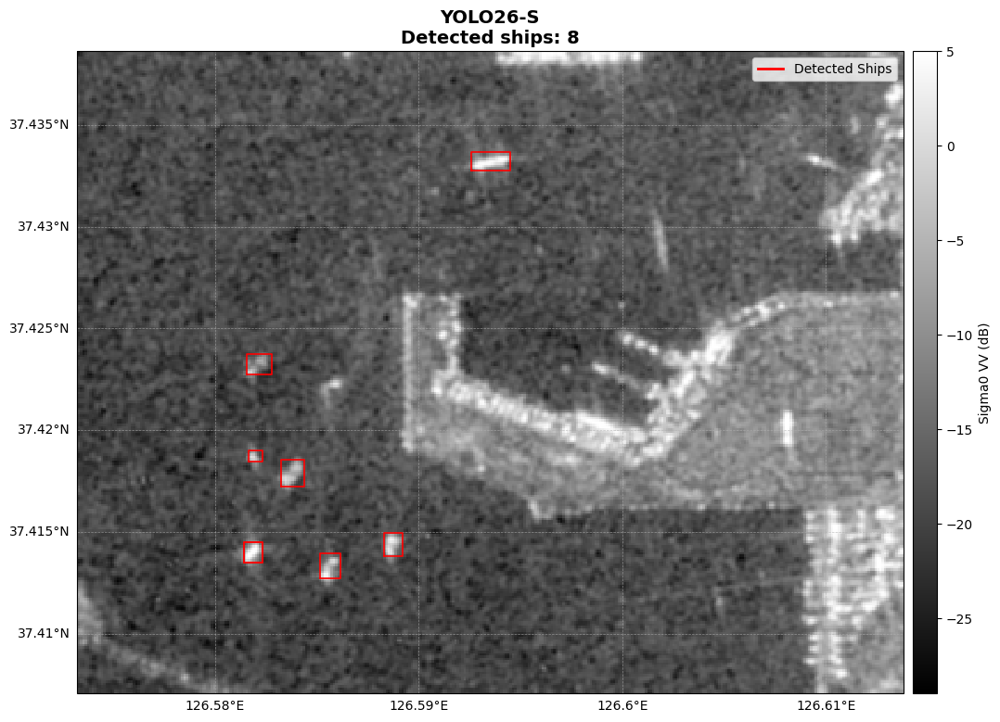

# Cross-Domain SAR Ship Detection with Dynamic Mixed Fine-Tuning

Domain-adaptive YOLO26-S ship detection using HRSID and LS-SSDD, with evaluation on unseen Sentinel-1 SAR imagery.

## Overview

This project investigates the domain gap that appears when a SAR ship detector trained on a benchmark dataset is directly applied to real Sentinel-1 imagery.

A YOLO26-S detector was first trained on **HRSID**. Although the model achieved strong performance on the HRSID benchmark, its confidence decreased substantially when it was directly applied to unseen Sentinel-1 IW GRD imagery.

To improve cross-domain performance without severely degrading the original HRSID detection capability, this project introduces a **dynamic mixed fine-tuning strategy** using:

- **HRSID** as the source-domain dataset
- **LS-SSDD** as a Sentinel-1-oriented adaptation dataset
- A controlled HRSID : LS-SSDD sampling ratio
- All HRSID training images retained in every fine-tuning epoch
- A different random LS-SSDD subset sampled at each epoch

The final 3:1 mixed fine-tuned model preserves strong HRSID benchmark performance while producing substantially stronger detection responses on unseen Sentinel-1 SAR scenes.

---

## Highlights

- YOLO26-S-based SAR ship detection
- HRSID benchmark training and evaluation
- Sentinel-1 domain-gap analysis
- LS-SSDD-based domain adaptation
- Catastrophic forgetting analysis
- Dynamic mixed fine-tuning with source-domain replay
- HRSID : LS-SSDD = **3 : 1** mixed training
- HRSID official test evaluation
- Direct inference on unseen Sentinel-1 IW GRD imagery
- Georeferenced visualization of ship detections
- Comparison between source-only, target-oriented, and mixed fine-tuning strategies

---

## Motivation

SAR ship detectors can perform well on benchmark datasets while showing significantly different behavior on real SAR imagery.

In this project, an HRSID-trained detector showed strong benchmark performance but weak confidence when directly applied to unseen Sentinel-1 imagery. This indicates a domain gap between the training and deployment data.

The difference is plausible because HRSID is a multi-sensor SAR dataset and its Sentinel-1 imagery is not identical to the Sentinel-1 IW GRD imagery used for deployment. Differences in imaging mode, spatial resolution, preprocessing, radiometry, sea clutter, incidence angle, and target appearance can affect detector confidence.

LS-SSDD was therefore introduced as an adaptation dataset because it was constructed from large-scale Sentinel-1 SAR imagery.

However, fine-tuning only on LS-SSDD caused severe degradation on HRSID, demonstrating **catastrophic forgetting**.

The objective of this project is therefore:

> Improve detection response on unseen Sentinel-1 imagery while preserving the original HRSID ship detection capability.

---

## Domain Adaptation Strategy

The overall experimental workflow is:

```text
COCO-pretrained YOLO26-S
          |
          v
     HRSID Training
          |
          v
  HRSID Ship Detector
          |
          +-----------------------------+
          |                             |
          v                             v
Direct Sentinel-1 Inference      LS-SSDD Fine-Tuning
                                        |
                                        v
                              Strong Domain Adaptation
                              but Catastrophic Forgetting
                                        |
                                        v
                         Dynamic Mixed Fine-Tuning
                           HRSID + LS-SSDD
                                        |
                                        v
                         Final Cross-Domain Detector
```

The mixed fine-tuning strategy is designed to balance two competing objectives:

1. **Source-domain retention** — preserve ship detection capability learned from HRSID.
2. **Target-domain adaptation** — expose the detector to Sentinel-1-oriented LS-SSDD imagery.

---

## Datasets

### 1. HRSID

HRSID is used as the primary SAR ship detection dataset.

The official dataset contains high-resolution SAR imagery from multiple sensors and provides ship bounding-box annotations.

### Split Used in This Project

```text
Official train set: 3,642 images
Official test set : 1,962 images

Training split    : 3,278 images
Validation split  :   364 images
Official test     : 1,962 images
```

The official training set was randomly divided into training and validation subsets, while the official HRSID test set was kept untouched for final evaluation.

The detection task contains one class:

```text
Class 0: Ship
```

---

### 2. LS-SSDD

LS-SSDD is a SAR ship detection dataset constructed from large-scale Sentinel-1 imagery.

It is used in this project as an additional domain-adaptation dataset.

After removing validation images from the original training list to prevent train-validation overlap, the split used in this project is:

```text
Training   : 5,100 images
Validation :   900 images
Test       : 3,000 images
```

Only the LS-SSDD training set is sampled during dynamic mixed fine-tuning.

---

### 3. Unseen Sentinel-1 SAR Imagery

The trained models are additionally applied to unseen Sentinel-1 SAR scenes that are not used as benchmark training data.

The target imagery is Sentinel-1 IW GRD data processed into calibrated Sigma0 imagery.

Example target areas include Korean coastal and port regions such as Ulsan.

These scenes are used for **qualitative cross-domain evaluation**. Because independent ship ground-truth annotations are not available for these scenes, detections should be interpreted as model-generated ship candidates rather than verified true positives.

---

## Sentinel-1 Preprocessing

The Sentinel-1 imagery used for direct inference is preprocessed before being passed to YOLO.

The workflow includes:

1. Spatial subset
2. Thermal noise removal
3. Border noise removal
4. Radiometric calibration
5. Conversion to Sigma0
6. Conversion to decibel scale
7. Intensity clipping and normalization
8. Conversion to an 8-bit YOLO-compatible image

For linear Sigma0 values:

```text
Sigma0(dB) = 10 × log10(Sigma0)
```

For model inference, the SAR image is clipped to:

```text
[-35 dB, 5 dB]
```

and normalized to:

```text
[0, 255]
```

The grayscale SAR image is replicated across three channels for YOLO inference.

---

## Baseline: HRSID-Only Training

The initial YOLO26-S model was trained on HRSID.

### Training Configuration

```text
Model       : YOLO26-S
Dataset     : HRSID
Input size  : 800 × 800
Epochs      : 20
Batch size  : 16
Task        : Ship detection
Classes     : 1
```

The HRSID-only detector achieved strong benchmark performance, with approximately:

```text
Precision    : 0.9001
Recall       : 0.7916
mAP@0.5      : 0.8913
mAP@0.5:0.95 : 0.6393
```

However, direct application to unseen Sentinel-1 imagery produced much lower detection confidence, indicating a substantial deployment-domain gap.

### Direct Application to Unseen Sentinel-1 Imagery

To examine whether the benchmark performance transfers to real Sentinel-1 imagery, the HRSID-only detector was directly applied to unseen Sentinel-1 IW GRD scenes without additional fine-tuning.

The following examples show detection results from four Sentinel-1 target scenes.









Despite its strong performance on the HRSID benchmark, the HRSID-only detector produced relatively weak responses on the unseen Sentinel-1 scenes. Many ship-like targets were assigned low confidence scores, and several visually apparent targets were not detected at a practical confidence threshold.

These results suggest that strong in-domain benchmark performance does not necessarily translate directly to unseen Sentinel-1 IW GRD imagery, indicating a substantial domain gap between HRSID and the deployment imagery.

Because independent ground-truth annotations are not available for these Sentinel-1 scenes, these examples are interpreted qualitatively rather than as quantitative detection accuracy.

---

## Experiment 1: LS-SSDD Fine-Tuning

The HRSID-trained model was fine-tuned on LS-SSDD to adapt it toward Sentinel-1 ship imagery.

### LS-SSDD Test Performance

```text
Precision    : 0.7590
Recall       : 0.6535
mAP@0.5      : 0.7364
mAP@0.5:0.95 : 0.2951
```

The model showed substantially stronger responses on unseen Sentinel-1 imagery.

However, evaluation on the HRSID domain revealed severe catastrophic forgetting.

### HRSID Performance After LS-SSDD Fine-Tuning

```text
Precision    : 0.0647
Recall       : 0.0399
mAP@0.5      : 0.0126
mAP@0.5:0.95 : 0.0062
```

This experiment demonstrates that naïve sequential fine-tuning can adapt the detector to a new SAR domain while almost completely destroying its original detection capability.

### Sentinel-1 Results After LS-SSDD Fine-Tuning

The LS-SSDD fine-tuned detector was subsequently applied to the same unseen Sentinel-1 scenes used for evaluating the HRSID-only model.









Compared with the HRSID-only detector, the LS-SSDD fine-tuned model produced substantially stronger detection responses on the unseen Sentinel-1 imagery. More ship-like targets were detected with moderate-to-high confidence, indicating that exposure to LS-SSDD improved the model's response to Sentinel-1-oriented SAR characteristics.

However, this improvement came at a substantial cost. When evaluated again on the HRSID domain, the model suffered severe catastrophic forgetting, with HRSID mAP@0.5 decreasing to 0.0126.

Therefore, LS-SSDD-only fine-tuning demonstrates that target-oriented adaptation can improve the model's response to unseen Sentinel-1 imagery, but naïve sequential fine-tuning does not preserve the detector's original source-domain capability.

---

## Dynamic Mixed Fine-Tuning

To reduce catastrophic forgetting, a mixed fine-tuning strategy was introduced.

Instead of fine-tuning exclusively on LS-SSDD, HRSID images are replayed during adaptation.

### 3:1 Sampling Strategy

For the final experiment:

```text
HRSID : LS-SSDD = 3 : 1
```

Every fine-tuning epoch contains:

```text
HRSID              : 3,278 images
LS-SSDD             : 1,093 images
--------------------------------
Total per epoch     : 4,371 images
```

All **3,278 HRSID training images are retained every epoch**.

The LS-SSDD samples are dynamically selected:

```text
LS-SSDD training pool : 5,100 images
Selected per epoch    : 1,093 images
Sampling              : Random subset
Subset changes        : Every epoch
```

This allows the model to see different LS-SSDD examples across fine-tuning epochs while consistently replaying the full HRSID source-domain training set.

### Fine-Tuning Configuration

```text
Initial model : HRSID-trained YOLO26-S
Epochs        : 5
Input size    : 800 × 800
Batch size    : 16
Optimizer     : AdamW
Learning rate : 1e-5
Ratio         : HRSID : LS-SSDD = 3 : 1
```

The low learning rate is intentionally used to adapt the existing detector without aggressively overwriting previously learned HRSID representations.

---

## Dynamic Dataset Construction

At each fine-tuning epoch:

```text
1. Load all 3,278 HRSID training images.
2. Randomly sample 1,093 images from the 5,100-image LS-SSDD pool.
3. Rebuild the mixed training directory.
4. Train YOLO26-S for one fine-tuning stage.
5. Use the resulting checkpoint for the next stage.
6. Repeat with a newly sampled LS-SSDD subset.
```

The HRSID validation set remains fixed:

```text
Validation images : 364
Validation labels : 364
```

The dynamic training dataset therefore changes its LS-SSDD component while preserving a constant source-domain replay set.

---

## HRSID Official Test Results

The final 3:1 dynamic mixed fine-tuned model was evaluated on the untouched HRSID official test set.

| Metric | Dynamic Mixed FT 3:1 |
|---|---:|
| Precision | **0.9023** |
| Recall | **0.7887** |
| mAP@0.5 | **0.8888** |
| mAP@0.5:0.95 | **0.6349** |

The model retains strong HRSID detection performance after adaptation.

Compared with LS-SSDD-only fine-tuning, the mixed strategy dramatically reduces catastrophic forgetting.

### Sentinel-1 Results After Dynamic Mixed Fine-Tuning

The final 3:1 dynamic mixed fine-tuned model was applied to the same unseen Sentinel-1 scenes used in the previous experiments.







The dynamic mixed fine-tuned detector produced substantially stronger responses to ship-like targets in the unseen Sentinel-1 scenes than the original HRSID-only model. Multiple targets were detected with moderate-to-high confidence, including confidence scores in the approximately 0.7–0.85 range in the evaluated scenes.

At the same time, unlike LS-SSDD-only fine-tuning, the model retained strong performance on the HRSID official test set, achieving an mAP@0.5 of 0.8898 and an mAP@0.5:0.95 of 0.6365.

These results demonstrate the main objective of the dynamic mixed fine-tuning strategy: improving the detector's response to unseen Sentinel-1 imagery while preserving most of its original HRSID detection capability.

Since independent ground-truth annotations are not available for the Sentinel-1 target scenes, the visual results are interpreted as qualitative evidence of improved cross-domain response rather than quantitative improvements in precision or recall.

### Cross-Domain Retention Comparison

| Model | HRSID mAP@0.5 | HRSID mAP@0.5:0.95 |
|---|---:|---:|
| HRSID-only | 0.8913 | 0.6393 |
| LS-SSDD fine-tuned | 0.0126 | 0.0062 |
| **Dynamic Mixed FT 3:1** | **0.8898** | **0.6365** |

The mixed model therefore retains most of the source-domain benchmark performance while incorporating Sentinel-1-oriented training data.

---

## Sentinel-1 Direct Inference

The models were also applied directly to unseen Sentinel-1 IW GRD imagery.

The HRSID-only detector produced relatively weak confidence on the target imagery despite its high HRSID benchmark accuracy.

After mixed fine-tuning, multiple ship-like targets produced substantially stronger confidence values, including detections in the approximately **0.7–0.85** range in the evaluated scenes.

Example output:

```text
YOLO26-S
Detected ship candidates: 43
```


The number of detections alone should not be interpreted as detection accuracy because independent ground-truth ship annotations are unavailable for these scenes.

Instead, these results are used as qualitative evidence that the mixed model responds more strongly to ship-like targets in unseen Sentinel-1 imagery while retaining HRSID benchmark performance.

---

## Experimental Comparison

| Training Strategy | HRSID Retention | Sentinel-1 Response | Main Observation |
|---|---|---|---|
| HRSID only | Excellent | Weak | Strong benchmark model but clear domain gap |
| HRSID → LS-SSDD | Very poor | Strong | Severe catastrophic forgetting |
| **HRSID + LS-SSDD Dynamic 3:1** | **Strong** | **Strong** | Best balance between retention and adaptation |

The experiments demonstrate that the adaptation problem cannot be solved simply by maximizing performance on the new dataset.

Instead, the source and adaptation domains must be balanced during fine-tuning.

---

## Key Findings

1. **High benchmark accuracy does not guarantee deployment-domain robustness.**  
   The HRSID-trained detector performed strongly on HRSID but showed substantially weaker confidence on unseen Sentinel-1 imagery.

2. **LS-SSDD provides useful Sentinel-1-oriented adaptation data.**  
   Fine-tuning on LS-SSDD substantially strengthened the detector's response to real Sentinel-1 imagery.

3. **Naïve sequential fine-tuning causes catastrophic forgetting.**  
   HRSID mAP@0.5 dropped to 0.0126 after LS-SSDD-only fine-tuning.

4. **Source-domain replay substantially reduces forgetting.**  
   Dynamic mixed fine-tuning restored HRSID mAP@0.5 to 0.8898.

5. **Dynamic sampling provides diverse adaptation exposure.**  
   Instead of repeatedly using one fixed LS-SSDD subset, a new subset is selected every epoch.

6. **A 3:1 HRSID-to-LS-SSDD ratio provides a strong retention-adaptation trade-off.**  
   The final model preserves high HRSID performance while producing stronger confidence on unseen Sentinel-1 scenes.

---

## Important Evaluation Note

The HRSID official test results are quantitative because ground-truth bounding boxes are available.

The unseen Sentinel-1 results are **qualitative** because independent ground-truth ship annotations are not available for the selected target scenes.

Therefore:

- HRSID metrics can be reported as quantitative detection performance.
- Sentinel-1 detection counts are model outputs, not verified ship counts.
- Higher target-domain confidence indicates stronger model response but does not by itself prove higher precision or recall.
- AIS or manually annotated Sentinel-1 ground truth would be required for rigorous target-domain accuracy evaluation.

---

## Repository Structure

A recommended repository structure is:

```text
SAR_Ship_Detection_Domain_Adaptation/
├── notebooks/
│   ├── Train_YOLO_HRSID.ipynb
│   ├── Train_YOLO_LS_SSDD.ipynb
│   ├── Mixed_Fine_Tuning_HRSID_LS_SSDD.ipynb
│   ├── Evaluate_HRSID_Official_Test.ipynb
│   └── Sentinel1_Direct_Inference.ipynb
│
├── figures/
│   ├── Domain_Adaptation_Workflow.png
│   ├── HRSID_Only_Sentinel1_Result.png
│   ├── LS_SSDD_FT_Sentinel1_Result.png
│   ├── Dynamic_3to1_Sentinel1_Result.png
│   └── Sentinel1_Dynamic_Mixed_FT_Result.png
│
├── MATLAB/
│   └── Mapping_Sentinel1.m
│
├── requirements.txt
├── LICENSE
├── .gitignore
└── README.md
```

Adjust notebook and figure names to match the files actually included in the repository.

---

## Suggested Figure Organization

For a portfolio-oriented repository, the most informative comparison figure is:

```text
(a) HRSID-only
        ↓
Weak confidence on unseen Sentinel-1

(b) LS-SSDD-only fine-tuning
        ↓
Strong Sentinel-1 response
but catastrophic forgetting

(c) Dynamic Mixed FT (3:1)
        ↓
Strong Sentinel-1 response
+ HRSID performance retention
```

A side-by-side figure using the **same Sentinel-1 scene and the same inference threshold** is recommended for a fair visual comparison.

---

## Requirements

The notebooks were developed in Google Colab.

Main dependencies include:

```text
Python
PyTorch
TorchVision
Ultralytics
OpenCV
NumPy
SciPy
Matplotlib
PyYAML
```

Example installation:

```bash
pip install torch torchvision ultralytics opencv-python numpy scipy matplotlib pyyaml
```

---

## Data Availability

The datasets and large SAR imagery are not included in this repository.

Users should obtain the datasets from their original providers and follow their respective licenses and terms of use.

### HRSID

HRSID is used as the primary SAR ship detection benchmark.

### LS-SSDD

LS-SSDD is used as the Sentinel-1-oriented adaptation dataset.

### Sentinel-1

Unseen Sentinel-1 IW GRD imagery is used for direct cross-domain inference.

Large datasets and trained model checkpoints may need to be stored separately due to repository size limitations.

---

## Limitations

This project has several limitations.

### 1. No Independent Ground Truth for Target Sentinel-1 Scenes

The selected Sentinel-1 deployment scenes do not have independent ship bounding-box annotations in this experiment.

Therefore, target-domain results cannot yet be expressed as precision, recall, or mAP.

### 2. Domain Adaptation Is Evaluated with a Limited Number of Deployment Scenes

Additional Sentinel-1 scenes covering different ports, sea states, acquisition geometries, and environmental conditions are required for a more comprehensive evaluation.

### 3. Mixed Fine-Tuning Ratio

The 3:1 ratio provides a strong experimental trade-off, but it should not be interpreted as a universally optimal ratio for every SAR dataset.

### 4. Bright-Target False Positives

Strong coastal structures and other bright SAR scatterers can still be detected as ship candidates.

---

## Future Work

Future improvements may include:

- Quantitative evaluation using manually annotated Sentinel-1 scenes
- AIS-based validation of detected ship locations
- Evaluation on additional Sentinel-1 acquisition dates and regions
- Comparison of additional source-to-target sampling ratios
- More systematic domain adaptation methods
- Domain-adversarial training
- Feature-level alignment
- SAR-specific augmentation
- Multi-polarization VV/VH fusion
- Improved suppression of coastal and bright-target false positives
- Evaluation on additional SAR ship datasets

---

## Conclusion

This project demonstrates a practical cross-domain adaptation problem in SAR ship detection.

A YOLO26-S detector trained on HRSID achieved strong benchmark performance but showed a substantial confidence drop when directly applied to unseen Sentinel-1 imagery. Fine-tuning exclusively on LS-SSDD improved target-domain response but caused severe catastrophic forgetting.

Dynamic mixed fine-tuning addresses this trade-off by replaying the complete HRSID training set while exposing the detector to a changing subset of LS-SSDD images.

With a **3:1 HRSID-to-LS-SSDD ratio**, the final model achieved:

```text
HRSID Official Test
Precision    : 0.9039
Recall       : 0.7864
mAP@0.5      : 0.8898
mAP@0.5:0.95 : 0.6365
```

while also producing substantially stronger confidence responses on unseen Sentinel-1 imagery.

The results show that **mixed-domain replay can provide a practical balance between source-domain retention and deployment-domain adaptation for SAR ship detection**.

---

## License

This project can be released under the MIT License if the repository code is intended for open-source distribution.

The datasets remain subject to their respective licenses and terms of use.

---

## Author

Jinho Lee  
Satellite Oceanography Laboratory  
Seoul National University
